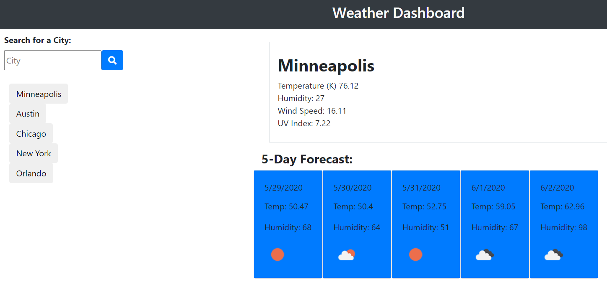

# homework6-weatherdash

## Project Description
The purpose of this activity is to create a create a weather dashboard so the user can quickly research their selected city to determine the weather. The HTML will display a search bar, a selection of cities of which when submitted for a search, will display the city name, the current day, the city's: temperature, Humidity, Wind Speed and UV index. Additionally, the UV index will highlight different colors depending on how harmful the UV is that day. Lastly, below the main weather item, it will display the next 5 day forecast along with temperature, humidity and a weather icon depicting weather it will be sunny, cloudy, raining, etc.

## Sources
- Reviewed available course videos and activities
- Open Weather website (https://openweathermap.org/api)
- momentjs.com
- Stack Overflow and Dev Mozilla search overviews for above items